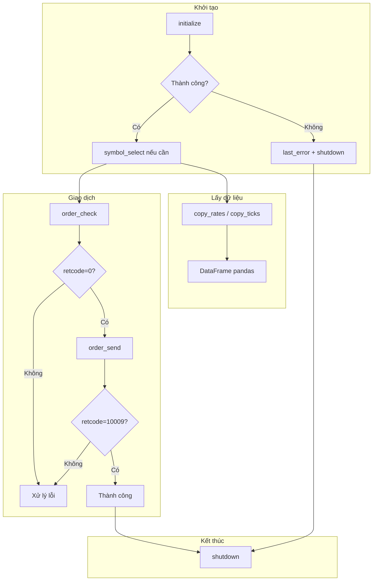

# Python MetaTrader 5

## Quick Start

**Cài đặt:**
```bash
pip install MetaTrader5
```

**Luồng cơ bản:**
1. `initialize()` để kết nối terminal
2. Thực hiện thao tác (lấy dữ liệu, giao dịch)
3. `shutdown()` khi kết thúc

**Kiểm tra lỗi:** Gọi `last_error()` sau mỗi thao tác thất bại (trả về tuple `(code, message)`).

---

## Connection & Account

### initialize()

Ba cách gọi:

```python
# 1. Tự tìm terminal
mt5.initialize()

# 2. Chỉ định path
mt5.initialize("C:/Program Files/MetaTrader 5/terminal64.exe")

# 3. Đầy đủ tham số
mt5.initialize(
    path="...",
    login=25115284,
    password="xxx",
    server="MetaQuotes-Demo",
    timeout=60000,
    portable=False
)
```

Trả về `True` nếu thành công, `False` nếu thất bại.

### Các hàm liên quan

| Hàm | Mô tả |
|-----|-------|
| `login(login, password, server)` | Đăng nhập tài khoản |
| `shutdown()` | Đóng kết nối - **luôn gọi khi kết thúc** |
| `account_info()` | Thông tin tài khoản (balance, currency, leverage...) |
| `terminal_info()` | Trạng thái và tham số terminal |
| `version()` | Phiên bản MT5 |

---

## Market Data

### Symbol

| Hàm | Mô tả |
|-----|-------|
| `symbols_total()` | Số lượng symbol trong terminal |
| `symbols_get()` | Danh sách tất cả symbol |
| `symbol_info(symbol)` | Thông tin chi tiết symbol (point, digits, volume_min...) |
| `symbol_info_tick(symbol)` | Tick cuối (bid, ask, last, volume) |
| `symbol_select(symbol, enable)` | Thêm/xóa symbol khỏi MarketWatch |

**Lưu ý:** Trước khi lấy dữ liệu hoặc giao dịch, kiểm tra `symbol_info.visible`. Nếu `False`, gọi `symbol_select(symbol, True)`.

### Bars (OHLC)

| Hàm | Mô tả |
|-----|-------|
| `copy_rates_from(symbol, timeframe, date_from, count)` | Bars từ ngày, lấy `count` nến |
| `copy_rates_from_pos(symbol, timeframe, start_pos, count)` | Bars từ vị trí index |
| `copy_rates_range(symbol, timeframe, date_from, date_to)` | Bars trong khoảng thời gian |

**TIMEFRAME:** `TIMEFRAME_M1`, `M5`, `M15`, `M30`, `H1`, `H4`, `D1`, `W1`, `MN1`.

**Cấu trúc bars:** numpy array với cột `time`, `open`, `high`, `low`, `close`, `tick_volume`, `spread`, `real_volume`.

### Ticks

| Hàm | Mô tả |
|-----|-------|
| `copy_ticks_from(symbol, date_from, count, flags)` | Ticks từ ngày |
| `copy_ticks_range(symbol, date_from, date_to, flags)` | Ticks trong khoảng |

**COPY_TICKS:** `COPY_TICKS_ALL`, `COPY_TICKS_INFO`, `COPY_TICKS_TRADE`.

### Market Depth (DOM)

| Hàm | Mô tả |
|-----|-------|
| `market_book_add(symbol)` | Đăng ký nhận Market Depth - **bắt buộc trước** khi get |
| `market_book_get(symbol)` | Lấy nội dung DOM (type=1 Bid, type=2 Ask) |
| `market_book_release(symbol)` | Hủy đăng ký - **luôn gọi khi xong** |

**Lưu ý:** DOM chỉ có sẵn cho một số symbol.

**Cấu trúc ticks:** numpy array với cột `time`, `bid`, `ask`, `last`, `volume`, `time_msc`, `flags`, `volume_real`.

### Timezone quan trọng

MT5 lưu thời gian theo **UTC**. Khi tạo `datetime` cho `copy_rates_*` hoặc `copy_ticks_*`, dùng UTC:

```python
import pytz
timezone = pytz.timezone("Etc/UTC")
utc_from = datetime(2020, 1, 10, tzinfo=timezone)
rates = mt5.copy_rates_from("EURUSD", mt5.TIMEFRAME_H4, utc_from, 10)
```

---

## Trading

### Luồng gửi lệnh

1. Chuẩn bị request dict
2. Gọi `order_check(request)` để kiểm tra margin/điều kiện
3. Nếu `retcode == 0`, gọi `order_send(request)`
4. Kiểm tra `result.retcode == mt5.TRADE_RETCODE_DONE` (10009)

### Cấu trúc request (dict)

Các trường thường dùng:

- `action`: Loại thao tác (TRADE_ACTION_DEAL, TRADE_ACTION_PENDING, ...)
- `symbol`: Tên symbol
- `volume`: Khối lượng (lots)
- `type`: Loại lệnh (ORDER_TYPE_BUY, ORDER_TYPE_SELL, ...)
- `price`: Giá (ask cho Buy, bid cho Sell)
- `sl`, `tp`: Stop Loss, Take Profit (có thể 0)
- `deviation`: Độ lệch tối đa (points)
- `magic`: Magic number
- `comment`: Ghi chú
- `type_filling`: ORDER_FILLING_RETURN, FOK, IOC
- `type_time`: ORDER_TIME_GTC, ORDER_TIME_DAY, ORDER_TIME_SPECIFIED
- `position`: Ticket vị thế (khi đóng/sửa)
- `order`: Ticket lệnh chờ (khi sửa/xóa)

### TRADE_ACTION_*

| Action | Mô tả |
|--------|-------|
| TRADE_ACTION_DEAL | Lệnh thị trường (mở/đóng ngay) |
| TRADE_ACTION_PENDING | Đặt lệnh chờ |
| TRADE_ACTION_SLTP | Sửa SL/TP của vị thế |
| TRADE_ACTION_MODIFY | Sửa lệnh chờ |
| TRADE_ACTION_REMOVE | Xóa lệnh chờ |
| TRADE_ACTION_CLOSE_BY | Đóng vị thế bằng vị thế ngược chiều |

### Market Execution

Với symbol dùng Market Execution, request mở lệnh chỉ cần: `action`, `symbol`, `volume`, `type`, `type_filling`. Không bắt buộc `price`, `deviation`.

### Instant/Request Execution

Cần thêm `price`, `deviation`, `sl`, `tp` (tùy chọn).

---

## Positions & Orders

### Vị thế mở

| Hàm | Mô tả |
|-----|-------|
| `positions_total()` | Số vị thế mở |
| `positions_get(symbol="EURUSD")` | Vị thế theo symbol |
| `positions_get(group="*USD*")` | Vị thế theo mask (có thể dùng `!EUR` để loại trừ) |
| `positions_get(ticket=123)` | Vị thế theo ticket |

### Lệnh chờ

| Hàm | Mô tả |
|-----|-------|
| `orders_total()` | Số lệnh chờ |
| `orders_get(symbol="EURUSD")` | Lệnh theo symbol |
| `orders_get(ticket=123)` | Lệnh theo ticket |

### Lịch sử

| Hàm | Mô tả |
|-----|-------|
| `history_orders_total(from_date, to_date)` | Số lệnh trong khoảng |
| `history_orders_get(from_date, to_date)` | Lệnh trong khoảng (có thể filter ticket, position) |
| `history_deals_total(from_date, to_date)` | Số deal trong khoảng |
| `history_deals_get(from_date, to_date)` | Deals trong khoảng |

---

## Error Handling

`last_error()` trả về tuple `(code, message)`.

**Mã lỗi thường gặp:**

| Code | Hằng số | Mô tả |
|------|---------|-------|
| -8 | RES_E_AUTO_TRADING_DISABLED | Auto-trading tắt trong MT5 |
| -10005 | RES_E_INTERNAL_FAIL_TIMEOUT | Timeout kết nối |
| -2 | RES_E_INVALID_PARAMS | Tham số không hợp lệ |
| -4 | RES_E_NOT_FOUND | Không tìm thấy dữ liệu (history) |

**order_send retcode:** `TRADE_RETCODE_DONE` (10009) = thành công.

---

## Workflow tổng quan



---

## Utility Scripts

Các script trong `scripts/` - chạy từ thư mục gốc project:

| Script | Mô tả | Ví dụ |
|--------|-------|-------|
| `check_connection.py` | Kiểm tra kết nối MT5 | `python scripts/check_connection.py` |
| `calc_margin.py` | Tính margin cho symbol/lot | `python scripts/calc_margin.py EURUSD 0.1` |
| `export_rates.py` | Export bars OHLC ra CSV | `python scripts/export_rates.py EURUSD H4 1000 out.csv` |

**export_rates.py** hỗ trợ `--dry-run` để mô phỏng không ghi file.

---

## Additional Resources

- **Chi tiết API, constants, structures:** [reference.md](reference.md)
- **Mẫu code thực tế:** [examples.md](examples.md)
